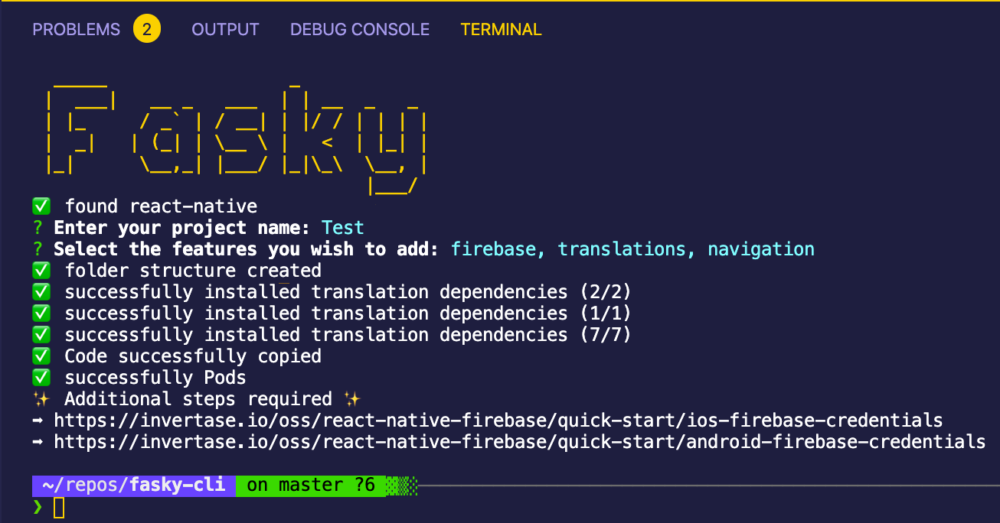

<h1 align="center"> Fasky CLI </h1>

    
    
    

    

  <strong>Faster project setup - more productivity</strong> 

## Table of Contents 📚

- [Installation](#introduction)
- [Usage](#usage)
- [Features](#features)
- [Contributors](#Contributors-)

## Installation 🔧

`npm install -g fasky`

## Usage 💡

Creating a best practice React-Native project is easier than ever thanks to the Fasky CLI. Simply type 'fasky' into your terminal and you're ready to go.

## Features 🏷

- Up2date React-Native project with typescript
- Firebase integration (optional)
- i18N translations (optional)
- Navigation framework (optional)

## Contributors 🤓

|  |  |
| ---------------------------------------------------------------------------------------------------------------------------------------------------------------------------------- | -------------------------------------------------------------------------------------------------------------------------------------- |
| 
[Max Haider](https://github.com/MaxHaider) 
                                                                                                                  | 
[Thomas Leiter](https://github.com/tomLadder) 
                                                                   | 
[Stefan Papst](https://github.com/sutefan1) 
 |
